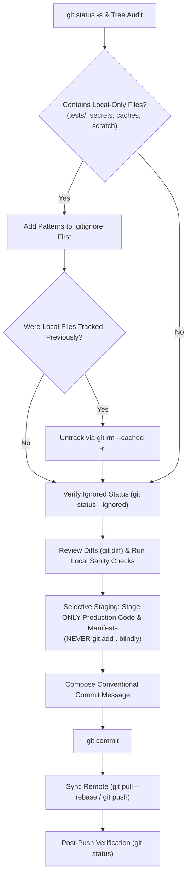

# Safe Git Commit & Smart Hygiene Skill

Use this skill whenever committing and pushing changes to a Git repository. Rather than blindly executing `git add .` or staging test suites and local files, this workflow enforces strict safety gates: auditing the working tree, identifying local-only artifacts (including local tests, test suites, secrets, caches, and scratch files), updating `.gitignore` first, verifying diffs, and authoring meaningful conventional commits.

---

## Safety Policy: What Must Stay Local

> [!IMPORTANT]
> **DIRECT INVOCATION AUTHORIZATION**:
> When this skill is directly or explicitly invoked by the user (such as via `/safe-git-commit`, "commit and push", "save changes to git", etc.), the invocation itself serves as explicit user permission and directive to stage, commit, and push.
> The agent MUST execute the complete workflow end-to-end (auditing, updating `.gitignore` if needed, staging, committing with a conventional commit message, and pushing upstream) without halting to ask for extra confirmation or approval.


> [!CAUTION]
> **NEVER BLINDLY STAGE OR PUSH LOCAL ASSETS.**
> Untracked files and local development artifacts must be added to `.gitignore` before any staging command is executed.
> Specifically, local test suites (`tests/`, `test/`, `__tests__/`), test mocks, and ad-hoc test scripts MUST NOT be pushed to the remote repository unless the user explicitly requests committing tests.

### Local-Only Artifact Blacklist

The following categories must **always stay local** and be protected in `.gitignore`:

1. **Local Tests, Test Suites & Mocks**:
   - Directories: `tests/`, `test/`, `__tests__/`, `spec/`
   - Files & patterns: `*.test.*`, `*.spec.*`, `test_*.py`, `*_test.py`, `conftest.py`
   - Test data & databases: `test.db`, `*.sqlite3`, mock JSON/CSV test fixtures created for local verification
2. **Secrets, API Keys & Credentials**:
   - `.env`, `.env.local`, `.env.*.local`, `*.pem`, `*.key`, `*.token`, `credentials.json`, `token.json`, `service_account*.json`
3. **Virtual Environments & Dependencies**:
   - `.venv/`, `venv/`, `env/`, `ENV/`, `node_modules/`, `target/`, `vendor/`, `Pods/`
4. **Caches, Build Outputs & Coverage Reports**:
   - Python: `__pycache__/`, `*.py[cod]`, `.pytest_cache/`, `.mypy_cache/`, `.ruff_cache/`, `htmlcov/`, `.coverage`, `dist/`, `build/`, `*.egg-info/`
   - Web/Node: `.next/`, `.nuxt/`, `.turbo/`, `dist/`, `build/`, `out/`, `*.tsbuildinfo`
   - General: `.cache/`, `*.log`, `tmp/`, `temp/`
5. **OS & Editor Settings**:
   - Windows: `Thumbs.db`, `ehthumbs.db`, `Desktop.ini`, `$RECYCLE.BIN/`
   - macOS: `.DS_Store`, `.AppleDouble`, `.LSOverride`
   - IDEs: `.vscode/`, `.idea/`, `*.swp`, `*.swo`, `*~`
6. **Scratch & Ad-Hoc Scripts**:
   - `scratch/`, `tmp_*.py`, `debug_*.py`, exploratory notebooks (`*.ipynb` unless core deliverable), local dump logs

---

## Execution Workflow



---

### Step 1: Working Tree Audit & Local Artifact Classification

1. Run `git status` and `git status -s` using `run_in_terminal` to inspect all tracked, modified, and untracked files.
2. Check every untracked file and modified file against the **Local-Only Artifact Blacklist**.
3. If any file belongs to the blacklist (especially `tests/`, test files, `.env`, caches, or local logs), flag it immediately for inclusion in `.gitignore`.

---

### Step 2: Update `.gitignore` and Untrack Local Files

Before staging any files:

1. **Inspect `.gitignore`**:
   - Read `.gitignore` using `read_file`. If it does not exist, create it.
2. **Add Missing Patterns**:
   - Append patterns under clean, dedicated headers:
     ```gitignore
     # Local tests & test artifacts
     tests/
     test/
     __tests__/
     *.test.*
     *.spec.*

     # Caches and build outputs
     __pycache__/
     .pytest_cache/
     .coverage
     htmlcov/

     # Secrets and environment files
     .env
     *.pem
     *.key
     credentials.json
     token.json

     # Logs and temporary files
     *.log
     tmp/
     temp/
     ```
3. **Untrack Accidentally Committed Local Files**:
   - If any blacklisted file or folder (e.g., `tests/`, `.env`, caches) is already tracked in Git, remove it from the Git index without deleting the local file:
     ```powershell
     git rm -r --cached tests/
     ```
4. **Confirm Ignored Status**:
   - Run `git status --ignored` to confirm that blacklisted items now appear under `Ignored files:` and NOT under `Changes to be committed:` or `Untracked files:`.

---

### Step 3: Review Diffs & Run Sanity Checks

1. **Inspect Diffs**:
   - Run `git diff` on modified files.
   - Verify that:
     - No accidental secrets, private tokens, or hardcoded local paths exist.
     - Production code cleanly compiles/imports.
2. **Execute Local Sanity Checks**:
   - Run local tests (e.g., `pytest tests/`, `npm test`) to ensure code works properly locally.
   - Verify that running tests does not regenerate untracked cache files outside `.gitignore`.

---

### Step 4: Selective & Intentional Staging

> [!WARNING]
> **DO NOT USE `git add .` OR `git add -A` BLINDLY.**
> Blind staging risks adding untracked test files, scratch scripts, or temporary data.

Stage only the explicit production files, manifests, and documentation:
```powershell
git add .gitignore README.md requirements.txt src/
```
Verify the staged index with `git status` to ensure that **only** intended production files are staged.

---

### Step 5: Compose Conventional Commit Message

Formulate clear, descriptive commit messages adhering to Conventional Commits:

- **Format**:
  ```
  <type>(<optional scope>): <imperative summary>

  - Detailed bullet point explaining why and what changed
  - Additional context, breaking changes, or references
  ```
- **Allowed Types**:
  - `feat`: A new production feature or enhancement.
  - `fix`: A bug fix in production code.
  - `refactor`: Production code refactoring.
  - `docs`: Documentation updates.
  - `chore`: Maintenance, dependencies, tooling, or `.gitignore` hygiene.
- **Execution**:
  ```powershell
  git commit -m "<type>: <concise summary>" -m "- <detail bullet 1>`n- <detail bullet 2>"
  ```
  *(Note: When this skill is directly called by the user, proceed immediately with the commit—do not halt for additional confirmation).*


---

### Step 6: Push Upstream & Final Verification

1. **Check Remote and Upstream Tracking**:
   - Run `git branch -vv` to verify the current branch and upstream tracker.
   - Rebase if needed: `git pull --rebase origin <current-branch>`.
2. **Push Commit**:
   - `git push origin <current-branch>`.
3. **Verify Clean Tree**:
   - Run `git status` to verify `Your branch is up to date` and `working tree clean`.
   - Provide the user with:
     - The commit hash and summary.
     - Confirmation of files committed vs files protected in `.gitignore`.

