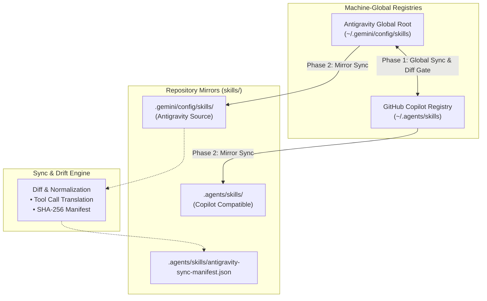

# Sync Skills

A specialized synchronization and drift-detection workflow for the `skills` repository. It provides two-way alignment and verification across:
1. **Global Skill Registries**: Synchronizes machine-global skills between Antigravity (`~/.gemini/config/skills`) and GitHub Copilot (`~/.agents/skills`). When the same skill exists in both with diverging edits, it computes and displays unified diffs and requests user confirmation before merging.
2. **Workspace Repository Mirrors**: Synchronizes the repository's `.gemini/config/skills` and `.agents/skills` trees with the actual machine-global directories.

---

## Architecture & Paths



| Environment | Path | Target Environment |
| :--- | :--- | :--- |
| **Antigravity Global** | `C:\Users\hyunwookim\.gemini\config\skills` | Google Antigravity |
| **Copilot Global** | `C:\Users\hyunwookim\.agents\skills` | GitHub Copilot |
| **Repo Antigravity Mirror** | `<repo>\.gemini\config\skills` | Google Antigravity |
| **Repo Copilot Mirror** | `<repo>\.agents\skills` | GitHub Copilot |

---

## Workflow

### Step 1: Pre-Sync Audit & Divergence Inspection
Always start by auditing the global trees and workspace mirrors in dry-run mode to inspect differences before applying any modifications.

Run the inspection command via `run_in_terminal`:
```powershell
pwsh -File ".agents\skills\sync-skills\scripts\sync_skills.ps1" -CheckOnly -ShowDiff
```

Inspect the output:
- **Shared Skills**: Skills present in both global directories. The script normalizes tool calls so formatting differences do not cause false alarms.
- **Divergent Skills**: If a shared skill has conflicting edits, the script marks it as `[DIFF DETECTED]` and outputs a unified diff.
- **Single-Sided Skills**: Skills present only in Antigravity or only in Copilot.
- **Workspace Mirror Drift**: Files missing or modified between the global directories and the repository.

---

### Step 2: User Review & Merge Gate for Divergent Skills
> [!IMPORTANT]
> If any shared skill has differences between Antigravity and Copilot:
> 1. Show the diff to the user.
> 2. Explain what changed in each version.
> 3. Ask the user for explicit confirmation before proceeding:
>    - Option A: Keep Antigravity version and overwrite Copilot (`-Direction AgyToCop -Force`).
>    - Option B: Keep Copilot version and overwrite Antigravity (`-Direction CopToAgy -Force`).
>    - Option C: Manually reconcile specific lines before running sync.
> Never overwrite conflicting skills without user consent.

---

### Step 3: Global Skills Synchronization (Antigravity <-> Copilot)
Once conflicting edits are resolved (or if only non-conflicting additions exist), synchronize the global directories:

```powershell
pwsh -File ".agents\skills\sync-skills\scripts\sync_skills.ps1" -SyncGlobal
```

What this does:
1. Copies new Antigravity skills to Copilot global, adapting tool invocations and paths.
2. Copies new Copilot skills to Antigravity global, adapting reverse tool invocations and paths.
3. Automatically skips any conflicting divergent skills unless `-Force` and `-Direction` are explicitly passed.
4. Generates and updates `antigravity-sync-manifest.json` in `~/.agents/skills/`.

---

### Step 4: Workspace Repository Synchronization
Synchronize the local repository folders with the actual global directories on the machine:

```powershell
pwsh -File ".agents\skills\sync-skills\scripts\sync_skills.ps1" -SyncWorkspace
```

What this does:
1. Copies all files from `~/.gemini/config/skills` into `.gemini/config/skills/`.
2. Copies all files from `~/.agents/skills` into `.agents/skills/`.
3. Purges stale files in the repository that were deleted from the actual global directories.
4. Updates the repository's `antigravity-sync-manifest.json`.
5. Outputs a `git status --short` report.

---

### Step 5: Catalog Update & Git Review
1. Inspect if any new skills were added or removed from the repository.
2. Update the skills catalog table in `README.md` and `.gemini/config/skills/README.md` if necessary.
3. Inspect the repository diffs via `run_in_terminal`:
   ```powershell
   git status --short
   git diff
   ```
4. Stage and commit the synchronized changes directly (`git add -A` and `git commit -m "feat(skills): sync global registries and workspace mirrors"`).
5. Push to remote (`git push origin main`) and present a concise summary of the committed and pushed changes. Do not ask for redundant permission when the instruction or skill workflow already directs the synchronization and commit to occur.


