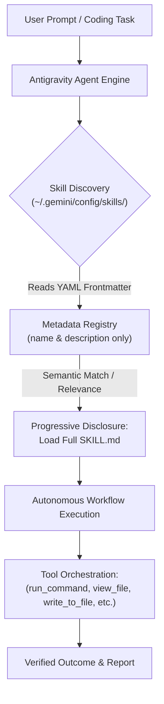

# Antigravity Custom Agent Skills

A curated library of personalized, production-grade agent skills for **Google Antigravity (AGY)**.

Unlike conventional software repositories containing applications, packages, or services, this repository serves as a **Machine-Global Agent Skill Registry**. It lives at the global customization root (`~/.gemini/config/skills/`) and endows the Antigravity pair-programming agent with specialized operational workflows, multi-step procedures, and tool automation runbooks.

---

## Architecture & How It Works

Antigravity employs **Progressive Disclosure** to expand agent capabilities while conserving context window tokens:



1. **Lightweight Discovery**: At session launch, Antigravity discovers all skills in `~/.gemini/config/skills/` and registers only their `name` and `description` from the YAML frontmatter.
2. **Progressive Disclosure**: When a user's prompt matches a skill's purpose, the agent dynamically pulls the full `SKILL.md` instructions into context.
3. **Deterministic Orchestration**: The agent executes the multi-step runbook, coordinating native system and file tools to achieve verified, consistent results.

---

## Skills Catalog

| Skill | Primary Focus | Key Capabilities |
| :--- | :--- | :--- |
| [`clone-github-repo`](./clone-github-repo/SKILL.md) | Remote Repository Ingestion | • Resolves GitHub/GitLab/SSH URLs & shorthand<br>• Pre-checks destination directories to avoid collision<br>• Detects landmark files (READMEs, manifests, configs)<br>• Proposes setup & environment initialization |
| [`generate-workspace-readme`](./generate-workspace-readme/SKILL.md) | Adaptive Repository Documentation | • Reads & analyzes existing README first to preserve style, structure, & domain knowledge<br>• Classifies repo type (CLI, library, service, agent config, ML) when absent<br>• Drafts tailored, domain-relevant layouts instead of generic templates<br>• Integrates accurate facts, env configs, & tailored Mermaid diagrams |
| [`safe-git-commit`](./safe-git-commit/SKILL.md) | Safe Commit & Git Hygiene | • Audits working tree to protect local-only files<br>• Enforces .gitignore updates before staging<br>• Runs sanity checks/tests before committing<br>• Crafts conventional commits & syncs upstream |
| [`sequential-image-extractor`](./sequential-image-extractor/SKILL.md) | Multi-Image Content Synthesis | • Naturally sorts numbered screenshots/slides with `scripts/sort_images.py`<br>• Transcribes tables, code blocks, and lists with layout fidelity<br>• Compiles individual markdown files and a synthesized `summary.md` |
| [`workspace-structure-organizer`](./workspace-structure-organizer/SKILL.md) | Codebase Architecture & Cleanup | • Detects root pollution & layout anti-patterns<br>• Reorganizes files safely using `git mv`<br>• Enforces idiomatic language layouts (Python, Node/TS, Go)<br>• Updates code imports and project configurations |

---

## Detailed Skill Specifications

### 1. [`clone-github-repo`](./clone-github-repo/SKILL.md)
Enables seamless repository cloning directly from the chat interface without manual terminal switching:
- **URL Resolution**: Handles standard HTTPS, SSH, and shorthand `<owner>/<repo>` identifiers.
- **Safety First**: Verifies destination folders with `list_dir` before initiating `git clone` to prevent accidental overwrites or aborts.
- **Post-Clone Inspection**: Automatically parses project landmarks (`pyproject.toml`, `package.json`, `.env.example`) to present actionable onboarding steps.

### 2. [`generate-workspace-readme`](./generate-workspace-readme/SKILL.md)
Creates or refreshes high-quality, comprehensive `README.md` documentation tailored to the specific project:
- **Existing README Analysis**: First parses existing README to preserve unique domain insights, custom sections, badges, and tone before updating stale details.
- **Domain-Specific Classification**: When starting fresh, diagnoses the repo type (CLI tool, library/SDK, web app/API, agent config, data science/ML pipeline, monorepo) and crafts a layout specifically relevant to that project.
- **Fact-Based Codebase Audit**: Verifies real commands, package manifests, and environment variables directly from source.
- **Tailored Visual Diagrams**: Generates valid Mermaid process flows, architectures, or CLI lifecycles that match the repository domain.

### 3. [`safe-git-commit`](./safe-git-commit/SKILL.md)
Enforces disciplined, safe Git commits with automated hygiene checks:
- **Local Artifact Audit**: Detects secrets (`.env`, credentials), caches (`.pytest_cache/`, `__pycache__/`), dependencies, and local scratch files.
- **Smart .gitignore First**: Automatically updates `.gitignore` to keep local-only files out of the repository before staging.
- **Diff & Pre-Commit Verification**: Reviews changes and validates test suites before committing code.
- **Conventional Commits**: Authors structured, descriptive commit messages with rationale and context.

### 4. [`sequential-image-extractor`](./sequential-image-extractor/SKILL.md)
Designed for processing ordered visual sequences (slide decks, document scans, tutorial screenshots):
- **Natural Numeric Sorting**: Uses an included Python helper script (`scripts/sort_images.py`) ensuring `slide_2.png` sorts before `slide_10.png`.
- **High-Fidelity Transcription**: Converts visual data into markdown tables, formatted code blocks, and structured text.
- **Consolidated Synthesis**: Assembles an overview table of contents and high-level analytical summary.

### 5. [`workspace-structure-organizer`](./workspace-structure-organizer/SKILL.md)
Transforms messy, cluttered workspaces into standard, maintainable codebases:
- **Root Cleanup**: Identifies misplaced scripts, scratch files, and loose test notebooks.
- **Safe Refactoring**: Uses `git mv` to preserve commit history during file migrations.
- **Import Integrity**: Updates relative and package imports when files are moved.

---

## Skill Anatomy & Authoring Guidelines

Every skill in this repository follows the standard Antigravity specification:

```
skills/
└── <skill-name>/
    ├── SKILL.md                 # Required: Frontmatter + Step-by-step instructions
    ├── scripts/                 # Optional: Helper utilities executed during the workflow
    ├── references/              # Optional: Reference documentation or cheat sheets
    └── examples/                # Optional: Concrete examples and templates
```

### `SKILL.md` Structure

```markdown
---
name: your-skill-name
description: Clear, concise description explaining when and why the agent should activate this skill.
---

# Your Skill Name

Brief statement of purpose.

## Workflow

### 1. Step One: Inspection & Pre-conditions
- Specific instructions and tool call conventions...

### 2. Step Two: Execution
- Concrete execution steps, handling edge cases...

### 3. Step Three: Verification & Reporting
- How to verify results and report them back to the user.
```

---

## Deployment & Discovery Scope

Antigravity discovers skills across two tiers:

1. **Global Customizations (`~/.gemini/config/skills/`)**:
   - Location of this repository.
   - Available across **all projects and workspaces** opened in Antigravity on this machine.
2. **Workspace Customizations (`.agents/skills/`)**:
   - Project-specific skills committed directly to individual project repositories.
   - Take precedence over global skills in the event of a naming conflict.

---

## Repository Design Note

Unlike standard application repositories, this repository does **not** include or require a `.gitignore`. All files herein are deliberate, curated markdown runbooks, documentation, and small utility scripts intended to be fully tracked and synchronized across environments.

## GitHub Copilot Mirror

The same skills are mirrored into the global GitHub Copilot registry at
`%USERPROFILE%\.agents\skills\`. Run [`sync-to-copilot.ps1`](./sync-to-copilot.ps1)
from PowerShell after changing a skill:

```powershell
./sync-to-copilot.ps1
```

The command writes `antigravity-sync-manifest.json` to the Copilot registry. Each
entry records the source SHA-256 hash used for the last sync, so a later check can
compare the current source hash with the manifest and reveal stale mirrors. The
script also translates the Antigravity tool names `run_command` and `view_file`
to Copilot's `run_in_terminal` and `read_file` names in mirrored Markdown files.
