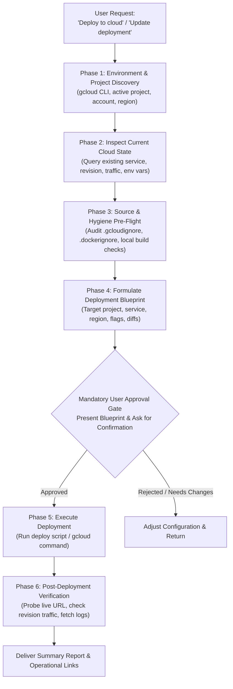

# Cloud Deployment & Service Update Skill

Use this skill whenever the user requests deploying an application to the cloud, updating an existing cloud service, rolling out a new revision, or configuring cloud infrastructure.

By default, all cloud deployments target **Google Cloud Platform (GCP)** (specifically **Cloud Run** for containerized apps, APIs, and full-stack web applications; **Cloud Functions** for event-driven micro-services; **App Engine** if `app.yaml` is present; or **Firebase** if `firebase.json` is present). The workflow adapts seamlessly across polyglot repositories and multi-service architectures while maintaining strict safety, hygiene, and cost governance.

---

## Safety Policy & Mandatory Verification Gate

> [!CAUTION]
> **NO AUTOMATIC CLOUD DEPLOYMENTS**
> Cloud deployments incur financial costs, network traffic, and production operational impact. Under NO circumstances should the agent execute cloud deployment commands (`gcloud run deploy`, `gcloud builds submit`, `gcloud app deploy`, `firebase deploy`, etc.) without:
> 1. Auditing local readiness, source code hygiene, and exclusion rules.
> 2. Presenting an explicit **Deployment Blueprint** (target project, service, region, resources, costs/impact).
> 3. Obtaining **explicit user confirmation** prior to triggering any remote cloud build or deployment command.

---

## Execution Workflow



---

## Phase 1: Environment & Workspace Discovery

1. **Verify Google Cloud SDK Availability**:
   Run `gcloud --version` via `run_command` to ensure the `gcloud` CLI is installed and responsive.
   ```powershell
   gcloud --version
   ```

2. **Discover Active Google Cloud Context**:
   Query active configuration, authenticated user, and project ID:
   ```powershell
   gcloud config get-value project
   gcloud auth list --filter=status:ACTIVE --format="value(account)"
   gcloud config get-value run/region
   ```
   If no default project is set, run `gcloud projects list --limit=5` and prompt the user to confirm the target project ID.

3. **Workspace Architecture & Landmark Detection**:
   Inspect the workspace root and subdirectories with `list_dir` to determine:
   - **Service Topology**:
     - Single service: Root contains `Dockerfile`, `package.json`, or `requirements.txt`.
     - Multi-service: Subdirectories such as `backend/` and `frontend/`, or `services/*`.
   - **Existing Deployment Assets**:
     - `Dockerfile` & `.dockerignore`
     - `.gcloudignore`
     - `cloudbuild.yaml` or `deploy/cloudbuild-*.yaml`
     - Dedicated deployment scripts in `deploy/` or `scripts/` (e.g., `deploy-all.ps1`, `deploy-backend.ps1`, `deploy.sh`)
     - `app.yaml` (Google App Engine)
     - `firebase.json` (Firebase Hosting / App Hosting)

4. **Port & Runtime Convention**:
   - Google Cloud Run automatically injects the `$PORT` environment variable (default: `8080`).
   - Ensure the application or Dockerfile binds to `0.0.0.0` and listens on `PORT` (e.g., `${PORT:-8080}`).

---

## Phase 2: Inspect Current Cloud Deployment State (Updates vs. New)

Before modifying anything, determine if the service already exists in the target GCP project:

1. **Query Existing Services**:
   ```powershell
   gcloud run services list --project=<project-id> --format="table(metadata.name,status.address.url,status.conditions[0].status,metadata.creationTimestamp)"
   ```

2. **Inspect Existing Service Configuration** (if updating):
   ```powershell
   gcloud run services describe <service-name> --region=<region> --project=<project-id> --format="json(status.url,spec.template.spec.containers[0].image,spec.template.spec.containers[0].resources,spec.template.spec.containers[0].env,status.traffic)"
   ```
   - Identify currently deployed container image and tag.
   - Inspect active environment variables and Secret Manager references.
   - Check resource limits (CPU, memory, concurrency) and scaling parameters (`min-instances`, `max-instances`).
   - Inspect current traffic split across revisions.

3. **Determine Delta**:
   Identify what has changed between the active deployment and the local workspace:
   - Code changes / new container build needed?
   - Environment variables or secrets added/updated?
   - Scaling or resource configuration modified?

---

## Phase 3: Source Hygiene & Local Pre-Flight Checks

1. **Exclusion Hygiene (`.gcloudignore` & `.dockerignore`)**:
   Uploading unnecessary or sensitive files to Cloud Build causes slow builds, security leaks, or bloated container images.
   - Verify `.gcloudignore` and `.dockerignore` exist in the service root.
   - Ensure the following are explicitly ignored:
     ```gitignore
     # Local environments and dependencies
     .venv/
     venv/
     node_modules/
     
     # Sensitive secrets and keys
     .env
     .env.local
     *.pem
     *.key
     service_account*.json
     credentials.json
     
     # Tests and local verification artifacts
     tests/
     test/
     *.test.*
     *.spec.*
     
     # Caches and build outputs
     __pycache__/
     .pytest_cache/
     .coverage
     dist/
     build/
     .git/
     ```
   - If `.gcloudignore` is missing, create it or copy relevant rules from `.gitignore`.

2. **Local Build & Sanity Check**:
   - Check `Dockerfile` syntax or run local lint/type check where feasible.
   - For Node/Next.js/Vite: test dependency validity or local build (`npm run build`) before pushing to avoid remote Cloud Build failures.
   - For Python: verify `requirements.txt` or `pyproject.toml` dependencies can be parsed cleanly.

3. **Service Account & IAM Readiness**:
   - Check if the application requires access to Google Cloud APIs (Cloud Storage, Vertex AI, Translation API, Secret Manager, Cloud SQL).
   - Verify if a custom runtime service account is specified or required:
     ```powershell
     gcloud iam service-accounts list --project=<project-id>
     ```

---

## Phase 4: Formulate Deployment Blueprint & User Approval Gate

Compile the proposed deployment plan into a structured markdown table and present it to the user.

### Deployment Blueprint Template

| Parameter | Current / Proposed Value | Notes |
| :--- | :--- | :--- |
| **Cloud Provider** | Google Cloud Platform (GCP) | Default provider |
| **GCP Project** | `<project-id>` | Active project |
| **Target Service** | `<service-name>` | e.g., `document-translator-backend` |
| **Target Region** | `<region>` | e.g., `asia-northeast1` / `us-central1` |
| **Action Type** | `New Deployment` OR `Update Existing Revision` | |
| **Build Mechanism** | `deploy/*.ps1` script / `cloudbuild.yaml` / `gcloud run deploy --source` | |
| **Public Access** | `--allow-unauthenticated` (Public) OR Private | Ingress configuration |
| **CPU / Memory** | `1 CPU / 512 MiB` (or custom) | |
| **Scaling** | `min-instances: 0, max-instances: 5` | Scale-to-zero when idle |
| **Key Env Vars** | `API_ENV=production, ...` | *No raw secrets in plaintext* |

> [!IMPORTANT]
> **MANDATORY APPROVAL GATE**:
> State clearly:
> *"According to the Cloud Deployment Policy, explicit user confirmation is required before running any cloud deployment. Please review the blueprint above and confirm if you would like to proceed with executing this deployment."*
> **DO NOT** execute deployment commands until the user provides explicit consent.

---

## Phase 5: Execute Deployment & Progress Tracking

Once explicit user confirmation is received:

1. **Execute via Workspace Deployment Script (Preferred if available)**:
   If the workspace contains standard deployment scripts (such as `deploy/deploy-backend.ps1`, `deploy/deploy-all.ps1`, `deploy/deploy-frontend.ps1`, or `cloudbuild.yaml`), prefer using them to maintain repository consistency:
   ```powershell
   # Example for workspace deploy script
   & .\deploy\deploy-backend.ps1 -ProjectId "<project-id>" -Region "<region>"
   ```

2. **Execute via Standard `gcloud` Commands (Direct Deployment)**:
   If no dedicated scripts exist:
   - **Direct Source Deploy to Cloud Run** (uses Cloud Build automatically):
     ```powershell
     gcloud run deploy <service-name> `
       --source . `
       --region <region> `
       --project <project-id> `
       --allow-unauthenticated `
       --memory 512Mi `
       --cpu 1 `
       --min-instances 0 `
       --max-instances 5
     ```
   - **Container Image Build + Deploy** (via Artifact Registry / Container Registry):
     ```powershell
     # 1. Build and push image
     gcloud builds submit --tag <region>-docker.pkg.dev/<project-id>/<repo>/<service-name>:latest .
     
     # 2. Deploy image to Cloud Run
     gcloud run deploy <service-name> `
       --image <region>-docker.pkg.dev/<project-id>/<repo>/<service-name>:latest `
       --region <region> `
       --project <project-id> `
       --allow-unauthenticated
     ```
   - **Configuration / Environment Update Only** (fast update without rebuild):
     ```powershell
     gcloud run services update <service-name> `
       --region <region> `
       --project <project-id> `
       --update-env-vars "KEY1=val1,KEY2=val2"
     ```

3. **Handle Common Deployment Errors**:
   - *API disabled*: Enable required APIs:
     ```powershell
     gcloud services enable run.googleapis.com cloudbuild.googleapis.com artifactregistry.googleapis.com --project=<project-id>
     ```
   - *Permission denied*: Ensure the active account or Cloud Build service account has `roles/run.admin`, `roles/iam.serviceAccountUser`, and `roles/artifactregistry.writer`.
   - *Container failed to start*: Check if the container listens on port `$PORT` and binds to `0.0.0.0`.

---

## Phase 6: Post-Deployment Verification & Health Checks

1. **Extract Live Service URL**:
   ```powershell
   $serviceUrl = gcloud run services describe <service-name> --region <region> --project <project-id> --format="value(status.url)"
   Write-Output "Service URL: $serviceUrl"
   ```

2. **Run HTTP Health Probe**:
   Test the live endpoint:
   ```powershell
   # Health check probe
   try {
       $response = Invoke-RestMethod -Uri "$serviceUrl/health" -Method Get -TimeoutSec 10
       Write-Output "Health probe successful: $($response | ConvertTo-Json -Compress)"
   } catch {
       # Fallback to root endpoint check
       $status = (Invoke-WebRequest -Uri $serviceUrl -Method Get -SkipHttpErrorCheck -TimeoutSec 10).StatusCode
       Write-Output "HTTP Status: $status"
   }
   ```

3. **Verify Traffic Split & Active Revision**:
   ```powershell
   gcloud run services describe <service-name> --region <region> --project <project-id> --format="table(status.traffic[].revisionName,status.traffic[].percent,status.traffic[].latestRevision)"
   ```

4. **Verify Runtime Logs for Startup Errors**:
   Check the latest 5-10 lines of logs to ensure no uncaught exceptions occurred during boot:
   ```powershell
   gcloud logging read "resource.type=cloud_run_revision AND resource.labels.service_name=<service-name>" --limit=10 --freshness=5m --project=<project-id> --format="table(timestamp,severity,textPayload)"
   ```

5. **Deliver Summary Report to User**:
   Provide a concise, professional report containing:
   - Clickable Service URL: `[Service URL](<service-url>)`
   - Active Revision Name
   - Health Probe Result
   - Useful maintenance commands:
     - View live logs: `gcloud run services logs tail <service-name> --region <region>`
     - Rollback command: `gcloud run services update-traffic <service-name> --region <region> --to-revisions=<previous-revision>=100`
