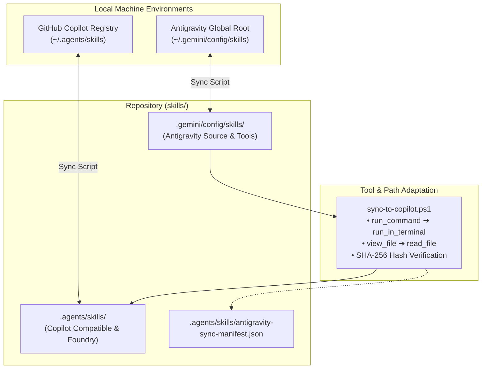

# Shared Agent Skills

A centralized repository for maintaining and synchronizing curated, production-grade agent skills across two primary AI agent environments:

- **Google Antigravity (AGY)**: Global customizations stored in `C:\Users\hyunwookim\.gemini\config\skills` (using native tools like `run_command` and `view_file`).
- **GitHub Copilot / CLI Agent**: Skills stored in `C:\Users\hyunwookim\.agents\skills` (using Copilot tools like `run_in_terminal` and `read_file`).

This repository mirrors both trees so that each environment can be version-controlled, maintained, and synchronized independently.

---

## Architecture & Synchronization



---

## Skills Catalog

| Skill | Description | .agents/skills | .gemini/config/skills |
| :--- | :--- | :---: | :---: |
| [`clone-github-repo`](.agents/skills/clone-github-repo/SKILL.md) | Clones remote Git repositories safely, checks for directory collisions, and inspects initial landmarks (`package.json`, `pyproject.toml`, etc.). | :white_check_mark: | :white_check_mark: |
| [`generate-workspace-readme`](.agents/skills/generate-workspace-readme/SKILL.md) | Analyzes existing READMEs to preserve domain knowledge or diagnoses repository type to draft tailored, production-grade documentation. | :white_check_mark: | :white_check_mark: |
| [`microsoft-foundry`](.agents/skills/microsoft-foundry/SKILL.md) | End-to-end management of Microsoft Foundry agents, prompt optimization, model deployments, quotas, RBAC, and telemetry tracing. | :white_check_mark: | — |
| [`safe-git-commit`](.agents/skills/safe-git-commit/SKILL.md) | Enforces clean Git hygiene by auditing working trees, updating `.gitignore` before staging secrets/caches, and writing conventional commits. | :white_check_mark: | :white_check_mark: |
| [`sequential-image-extractor`](.agents/skills/sequential-image-extractor/SKILL.md) | Transcribes ordered screenshot sequences, slides, and tables into markdown using natural numerical sorting (`sort_images.py`). | :white_check_mark: | :white_check_mark: |
| [`workspace-organizer`](.agents/skills/workspace-organizer/SKILL.md) | Restructures cluttered workspaces, cleans root directories, maintains `.gitignore` rules, and enriches code with types and docstrings. | :white_check_mark: | :white_check_mark: |

---

## Repository Structure

```text
skills/
├── .agents/
│   └── skills/
│       ├── antigravity-sync-manifest.json      # SHA-256 sync verification manifest
│       ├── clone-github-repo/
│       ├── generate-workspace-readme/
│       ├── microsoft-foundry/                  # Multi-component Azure AI Foundry skill
│       ├── safe-git-commit/
│       ├── sequential-image-extractor/
│       │   └── scripts/sort_images.py
│       └── workspace-organizer/
├── .gemini/
│   └── config/
│       └── skills/
│           ├── README.md                       # Antigravity registry documentation
│           ├── sync-to-copilot.ps1             # Tool adapter and mirror generator
│           ├── clone-github-repo/
│           ├── generate-workspace-readme/
│           ├── safe-git-commit/
│           ├── sequential-image-extractor/
│           │   └── scripts/sort_images.py
│           └── workspace-organizer/
└── README.md                                   # Root repository documentation
```

---

## Source-of-Truth Rules

1. **Local Tree Origin**: Add or edit a skill in the local source tree that uses it.
2. **Mirroring**: Copy the changed files into the matching repository folder.
3. **Tree Independence**: Keep `.agents/skills` and `.gemini/config/skills` separate. A skill may exist in one tree, the other, or both.
4. **Clean Tracking**: Never copy `.git` directories, caches, credentials, or machine-specific files into either repository folder.
5. **Pre-commit Audit**: Review the staged file list before committing.

The repository's `.agents/skills` and `.gemini/config/skills` folders are synchronization targets, not a third source of truth.

---

## Sync From Local Folders

Run these commands from PowerShell after changing local skills:

```powershell
$repo = 'C:\Users\hyunwookim\skills'
$antigravity = 'C:\Users\hyunwookim\.agents\skills'
$copilot = 'C:\Users\hyunwookim\.gemini\config\skills'

Get-ChildItem -LiteralPath (Join-Path $repo '.agents\skills') -Force |
    Remove-Item -Recurse -Force
Get-ChildItem -LiteralPath (Join-Path $repo '.gemini\config\skills') -Force |
    Where-Object Name -ne '.git' |
    Remove-Item -Recurse -Force

Get-ChildItem -LiteralPath $antigravity -Force |
    Copy-Item -Destination (Join-Path $repo '.agents\skills') -Recurse -Force
Get-ChildItem -LiteralPath $copilot -Force |
    Where-Object Name -ne '.git' |
    Copy-Item -Destination (Join-Path $repo '.gemini\config\skills') -Recurse -Force
```

> [!NOTE]
> The cleanup step prevents deleted or renamed local skills from lingering in Git. The `.git` exclusion is required because the source folder may itself be a Git checkout.

---

## Verify Before Commit

Compare relative file lists and SHA-256 hashes for each source and target pair. At minimum, confirm that:

- Every source file has a matching repository file.
- No repository file exists only in the target.
- Hash mismatches are zero.
- No path contains a nested `.git` directory.

Then inspect the staged paths:

```powershell
git -C C:\Users\hyunwookim\skills status --short
git -C C:\Users\hyunwookim\skills diff --cached --name-only
```

Only the two maintained trees and intentionally changed documentation should be staged.

---

## Commit And Push

```powershell
$repo = 'C:\Users\hyunwookim\skills'
git -C $repo add README.md .agents .gemini
git -C $repo commit -m 'chore: sync agent skill trees'
git -C $repo push origin main
git -C $repo status --short --branch
```

The expected final state is a clean `main` branch synchronized with `origin/main`.

---

## Adding A New Skill

Create the skill directory in the appropriate local source tree with a `SKILL.md` file containing valid YAML frontmatter:

```markdown
---
name: example-skill
description: Explain when this skill should be used.
---

# Example Skill Name

Brief statement of purpose and trigger conditions.

## Workflow

### 1. Step One
Instructions...
```

Sync the matching repository folder, verify the result, and commit the change. If both environments should use the skill, add it to both local source trees (or use `.gemini/config/skills/sync-to-copilot.ps1`) and verify both copies independently.