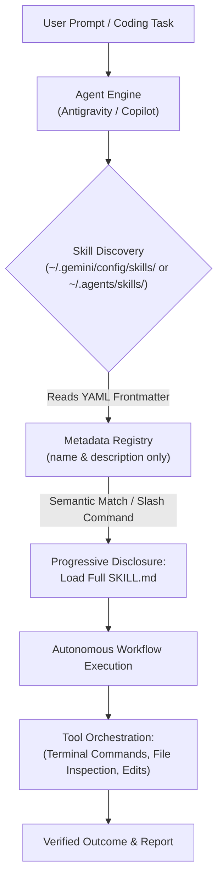
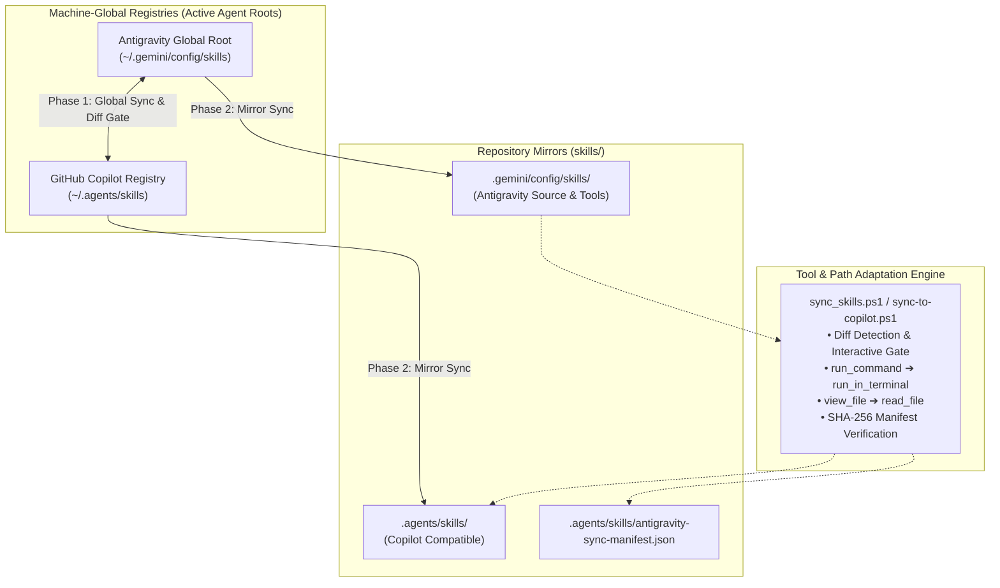

# Shared Agent Skills

A centralized repository for maintaining and synchronizing curated, production-grade agent skills across two primary AI agent environments:

- **Google Antigravity (AGY)**: Machine-global customizations stored in `C:\Users\hyunwookim\.gemini\config\skills` (using native tools like `run_command` and `view_file`).
- **GitHub Copilot / CLI Agent**: Machine-global skills stored in `C:\Users\hyunwookim\.agents\skills` (using Copilot tools like `run_in_terminal` and `read_file`).

Unlike conventional software repositories containing applications, packages, or services, this repository serves as a **Centralized Agent Skill Registry & Mirror**. It endows pair-programming agents with specialized operational workflows, multi-step procedures, and tool automation runbooks while managing cross-platform compatibility.

---

## Architecture & How It Works

### Progressive Disclosure Model
Both Antigravity and Copilot employ **Progressive Disclosure** to expand agent capabilities while conserving context window tokens:



1. **Lightweight Discovery**: At session launch, the agent engine discovers all skills and registers only their `name` and `description` from the YAML frontmatter.
2. **Progressive Disclosure**: When a user's prompt matches a skill's purpose or when a slash command is invoked, the agent dynamically pulls the full `SKILL.md` instructions into context.
3. **Deterministic Orchestration**: The agent executes the multi-step runbook, coordinating native system and file tools to achieve verified, consistent results.

---

## Dual-Environment Synchronization Architecture



| Environment | Machine Path | Primary Tools | Repo Mirror |
| :--- | :--- | :--- | :--- |
| **Google Antigravity** | `C:\Users\hyunwookim\.gemini\config\skills` | `run_command`, `view_file` | `.gemini/config/skills/` |
| **GitHub Copilot** | `C:\Users\hyunwookim\.agents\skills` | `run_in_terminal`, `read_file` | `.agents/skills/` |

---

## Skills Catalog

| Skill | Primary Focus | .agents/skills (Copilot) | .gemini/config/skills (Antigravity) |
| :--- | :--- | :---: | :---: |
| [`clone-github-repo`](.agents/skills/clone-github-repo/SKILL.md) | Remote Repository Ingestion & Onboarding | [Copilot](.agents/skills/clone-github-repo/SKILL.md) | [Antigravity](.gemini/config/skills/clone-github-repo/SKILL.md) |
| [`cloud-deploy`](.agents/skills/cloud-deploy/SKILL.md) | Universal Cloud Deployment & Service Updates | [Copilot](.agents/skills/cloud-deploy/SKILL.md) | [Antigravity](.gemini/config/skills/cloud-deploy/SKILL.md) |
| [`generate-workspace-readme`](.agents/skills/generate-workspace-readme/SKILL.md) | Adaptive Repository Documentation & Auditing | [Copilot](.agents/skills/generate-workspace-readme/SKILL.md) | [Antigravity](.gemini/config/skills/generate-workspace-readme/SKILL.md) |
| [`safe-git-commit`](.agents/skills/safe-git-commit/SKILL.md) | Disciplined Git Commits & .gitignore Hygiene | [Copilot](.agents/skills/safe-git-commit/SKILL.md) | [Antigravity](.gemini/config/skills/safe-git-commit/SKILL.md) |
| [`sequential-image-extractor`](.agents/skills/sequential-image-extractor/SKILL.md) | Multi-Image Transcription & Natural Numerical Sorting | [Copilot](.agents/skills/sequential-image-extractor/SKILL.md) | [Antigravity](.gemini/config/skills/sequential-image-extractor/SKILL.md) |
| [`sync-skills`](.agents/skills/sync-skills/SKILL.md) | Cross-Registry Synchronization & Drift Detection | [Copilot](.agents/skills/sync-skills/SKILL.md) | [Antigravity](.gemini/config/skills/sync-skills/SKILL.md) |
| [`workspace-organizer`](.agents/skills/workspace-organizer/SKILL.md) | Workspace Architecture, Root Cleanup & Code Typing | [Copilot](.agents/skills/workspace-organizer/SKILL.md) | [Antigravity](.gemini/config/skills/workspace-organizer/SKILL.md) |

---

## Detailed Skill Specifications

### 1. [`clone-github-repo`](.gemini/config/skills/clone-github-repo/SKILL.md)
Enables seamless repository cloning directly from the agent interface without manual terminal switching:
- **URL Resolution**: Handles standard HTTPS, SSH, and shorthand `<owner>/<repo>` identifiers.
- **Collision Protection**: Verifies destination folders beforehand to prevent accidental overwrites or aborts.
- **Landmark Inspection**: Parses project landmarks (`pyproject.toml`, `package.json`, `.env.example`) to propose actionable onboarding steps.

### 2. [`cloud-deploy`](.gemini/config/skills/cloud-deploy/SKILL.md)
Orchestrates end-to-end cloud deployments and revision updates with Google Cloud as default:
- **Universal Workspaces**: Adapts to single-container apps, microservices, and full-stack setups (`backend/` + `frontend/`).
- **Google Cloud Run First**: Targets Cloud Run containerized deployments with automatic `$PORT` handling and revision tracking.
- **Mandatory Safety & Approval Gate**: Halts prior to cloud execution, presenting a clear Deployment Blueprint for explicit user confirmation.
- **Live Health Probes**: Automatically checks live service URLs, HTTP status codes, and runtime logs post-deployment.

### 3. [`generate-workspace-readme`](.gemini/config/skills/generate-workspace-readme/SKILL.md)
Creates or refreshes high-quality, comprehensive `README.md` documentation tailored to the specific project:
- **Existing README Analysis**: Parses existing documentation first to preserve domain insights, custom sections, badges, and tone before updating stale details.
- **Domain-Specific Classification**: Diagnoses repository type (CLI tool, library/SDK, web app/API, agent config, ML pipeline) and crafts a relevant layout rather than using a generic template.
- **Fact-Based Codebase Audit**: Verifies real commands, package manifests, and environment variables directly from source.
- **Tailored Visual Diagrams**: Generates valid Mermaid process flows, architectures, or CLI lifecycles matching the project domain.

### 4. [`safe-git-commit`](.gemini/config/skills/safe-git-commit/SKILL.md)
Enforces disciplined, safe Git commits with automated hygiene checks:
- **Local Artifact Audit**: Detects secrets (`.env`, credentials), caches (`.pytest_cache/`, `__pycache__/`), and local scratch files.
- **Smart .gitignore First**: Automatically updates `.gitignore` to keep local-only files out of the repository before staging.
- **Diff & Pre-Commit Verification**: Reviews changes and validates test suites before committing code.
- **Conventional Commits**: Authors structured, descriptive commit messages with rationale and context.

### 5. [`sequential-image-extractor`](.gemini/config/skills/sequential-image-extractor/SKILL.md)
Processes ordered visual sequences (slide decks, document scans, tutorial screenshots):
- **Natural Numeric Sorting**: Uses an included Python helper script (`scripts/sort_images.py`) ensuring `slide_2.png` sorts before `slide_10.png`.
- **High-Fidelity Transcription**: Converts visual data into markdown tables, formatted code blocks, and structured text.
- **Consolidated Synthesis**: Assembles individual transcribed markdown files and a synthesized `summary.md`.

### 6. [`sync-skills`](.gemini/config/skills/sync-skills/SKILL.md)
Provides two-way alignment and verification across machine-global registries and workspace repository mirrors:
- **Pre-Sync Audit & Diff Gate**: Checks differences across Antigravity and Copilot registries, displaying unified diffs when conflicting edits exist.
- **Cross-Environment Translation**: Automatically adapts tool call signatures between Antigravity (`run_command`, `view_file`) and Copilot (`run_in_terminal`, `read_file`).
- **Workspace Mirror Alignment**: Synchronizes the repository's `.gemini/config/skills` and `.agents/skills` trees directly from machine-global directories with stale file pruning.
- **Integrity Manifest**: Maintains `antigravity-sync-manifest.json` with SHA-256 hashes to verify sync status.

### 7. [`workspace-organizer`](.gemini/config/skills/workspace-organizer/SKILL.md)
Transforms messy, cluttered workspaces into standard, maintainable codebases while improving script quality:
- **Root Cleanup & Restructuring**: Identifies misplaced scripts, scratch files, and loose test notebooks; migrates files safely using `git mv`.
- **Import & Path Integrity**: Updates relative and package imports and configurations when files are moved.
- **Script & Code File Enrichment**: Audits scripts to add missing module headers, CLI usage docs, and inline comments for complex logic.
- **Type Annotations & Signatures**: Enforces explicit typing across Python (PEP 484), TypeScript/JavaScript (JSDoc), and PowerShell (`[CmdletBinding()]` and parameter types).
- **Documentation Drift Remediation**: Corrects outdated docstrings, stale parameter descriptions, and broken references.

---

## Repository Structure

```text
skills/
├── .agents/
│   └── skills/
│       ├── antigravity-sync-manifest.json      # SHA-256 sync verification manifest
│       ├── clone-github-repo/                  # Git repository cloning workflow
│       ├── cloud-deploy/                       # Google Cloud deployment orchestrator
│       ├── generate-workspace-readme/          # Adaptive README generator & auditor
│       ├── safe-git-commit/                    # Git hygiene & pre-commit audit
│       ├── sequential-image-extractor/         # Screenshot sequence transcription
│       │   └── scripts/sort_images.py          # Natural numeric sorting utility
│       ├── sync-skills/                        # Cross-registry & workspace sync
│       │   └── scripts/sync_skills.ps1         # Two-way sync & drift detection script
│       └── workspace-organizer/                # Root hygiene & code typing enrichment
├── .gemini/
│   └── config/
│       └── skills/
│           ├── sync-to-copilot.ps1             # Tool adapter and mirror generator
│           ├── clone-github-repo/
│           ├── cloud-deploy/
│           ├── generate-workspace-readme/
│           ├── safe-git-commit/
│           ├── sequential-image-extractor/
│           │   └── scripts/sort_images.py
│           ├── sync-skills/
│           │   └── scripts/sync_skills.ps1
│           └── workspace-organizer/
└── README.md                                   # Consolidated repository & skill registry documentation
```

---

## Skill Anatomy & Authoring Guidelines

Every skill in this repository follows the standard specification:

```text
skills/
└── <skill-name>/
    ├── SKILL.md                 # Required: YAML Frontmatter + Step-by-step instructions
    ├── scripts/                 # Optional: Helper utilities executed during the workflow
    ├── references/              # Optional: Reference documentation or cheat sheets
    └── examples/                # Optional: Concrete examples and templates
```

### `SKILL.md` Structure

```markdown
---
name: your-skill-name
description: Clear, concise description explaining when and why the agent should activate this skill.
---

# Your Skill Name

Brief statement of purpose and trigger conditions.

## Workflow

### 1. Step One: Inspection & Pre-conditions
- Specific instructions and tool call conventions...

### 2. Step Two: Execution
- Concrete execution steps, handling edge cases...

### 3. Step Three: Verification & Reporting
- How to verify results and report them back to the user.
```

---

## Deployment & Discovery Scope

Skills operate across two tiers of discovery:

1. **Global Customizations (`~/.gemini/config/skills/` and `~/.agents/skills/`)**:
   - Machine-wide installations.
   - Available across **all projects and workspaces** opened in Antigravity or GitHub Copilot on this machine.
2. **Workspace Customizations (`.agents/skills/` or `.gemini/config/skills/`)**:
   - Project-specific skills committed directly to individual project repositories.
   - Take precedence over global skills in the event of a naming conflict.

---

## Synchronization Workflows

### Method 1: Automated Sync via `sync-skills` (Recommended)

The [`sync-skills`](.gemini/config/skills/sync-skills/SKILL.md) workflow provides end-to-end drift detection, diff inspection, and safe bidirectional synchronization:

```powershell
# Step 1: Pre-sync audit (check differences and drift without modifying files)
pwsh -File ".gemini\config\skills\sync-skills\scripts\sync_skills.ps1" -CheckOnly -ShowDiff

# Step 2: Synchronize machine-global registries (Antigravity <-> Copilot)
pwsh -File ".gemini\config\skills\sync-skills\scripts\sync_skills.ps1" -SyncGlobal

# Step 3: Synchronize repository workspace mirrors from machine-global registries
pwsh -File ".gemini\config\skills\sync-skills\scripts\sync_skills.ps1" -SyncWorkspace
```

> [!NOTE]
> If a shared skill has conflicting manual edits between Antigravity and Copilot, the script halts with `[DIFF DETECTED]` and outputs a unified diff. Resolve the conflict or specify `-Direction AgyToCop` / `-Direction CopToAgy` with `-Force`.

---

### Method 2: Manual Sync Fallback

If running commands directly in PowerShell without the automated script:

```powershell
$repo = 'C:\Users\hyunwookim\skills'
$antigravity = 'C:\Users\hyunwookim\.gemini\config\skills'
$copilot = 'C:\Users\hyunwookim\.agents\skills'

# Clean existing workspace mirrors (excluding .git)
Get-ChildItem -LiteralPath (Join-Path $repo '.agents\skills') -Force |
    Remove-Item -Recurse -Force
Get-ChildItem -LiteralPath (Join-Path $repo '.gemini\config\skills') -Force |
    Where-Object Name -ne '.git' |
    Remove-Item -Recurse -Force

# Copy from machine-global registries into workspace mirrors
Get-ChildItem -LiteralPath $copilot -Force |
    Copy-Item -Destination (Join-Path $repo '.agents\skills') -Recurse -Force
Get-ChildItem -LiteralPath $antigravity -Force |
    Where-Object Name -ne '.git' |
    Copy-Item -Destination (Join-Path $repo '.gemini\config\skills') -Recurse -Force
```

---

## Verify Before Commit

Compare relative file lists and SHA-256 hashes for each source and target pair. At minimum, confirm that:

- Every source file has a matching repository file.
- No repository file exists only in the target.
- Hash mismatches are zero (`pwsh -File .gemini/config/skills/sync-to-copilot.ps1 -Check`).
- No path contains a nested `.git` directory or ephemeral cache.

Inspect the repository status:

```powershell
git -C C:\Users\hyunwookim\skills status --short
git -C C:\Users\hyunwookim\skills diff --cached --name-only
```

Only the two maintained trees and intentionally changed documentation should be staged.