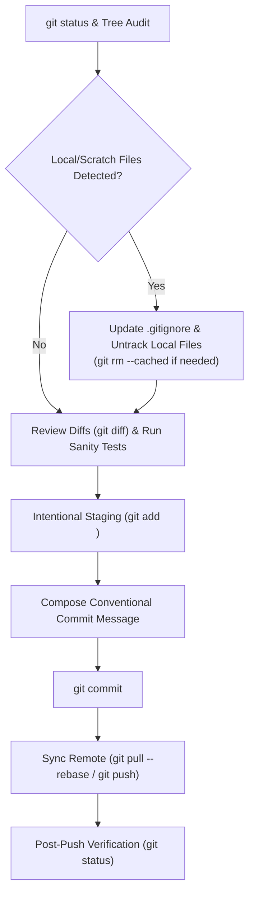

# Safe Git Commit & Smart Hygiene Skill

Use this skill whenever committing and pushing changes in a Git repository. Rather than blindly executing `git add .` and `git push`, this workflow enforces strict safety gates: auditing the working tree, identifying local-only artifacts to add to `.gitignore`, verifying file diffs, performing pre-commit sanity checks, and authoring meaningful conventional commits.

---

## Execution Workflow



---

### 1. Working Tree Audit & Local Artifact Classification

Run `git status` and `git status -s` using `run_command` to inspect all tracked, modified, and untracked files.

Examine untracked or modified files to determine if any **must stay local** and **never** be pushed upstream:

1. **Secrets, API Keys & Credentials**:
   - `.env`, `.env.local`, `.env.*.local`, `*.pem`, `*.key`, `*.token`, `credentials.json`, `token.json`, `service_account*.json`.
2. **Virtual Environments & Dependency Directories**:
   - `.venv/`, `venv/`, `env/`, `ENV/`, `node_modules/`, `target/`, `vendor/`, `Pods/`.
3. **Caches, Build Outputs & Generated Artifacts**:
   - Python: `__pycache__/`, `*.py[cod]`, `.pytest_cache/`, `.mypy_cache/`, `.ruff_cache/`, `htmlcov/`, `.coverage`, `dist/`, `build/`, `*.egg-info/`.
   - Web/Node: `.next/`, `.nuxt/`, `.turbo/`, `dist/`, `build/`, `out/`, `*.tsbuildinfo`.
   - General: `.cache/`, `*.log`, `tmp/`, `temp/`.
4. **OS & IDE Metadata**:
   - Windows: `Thumbs.db`, `ehthumbs.db`, `Desktop.ini`, `$RECYCLE.BIN/`.
   - macOS: `.DS_Store`, `.AppleDouble`, `.LSOverride`.
   - IDEs: `.vscode/` (unless team-shared tasks are strictly defined), `.idea/`, `*.swp`, `*.swo`.
5. **Scratch & Local Experiment Files**:
   - Scratch test scripts, temporary data files, test database dumps (`*.sqlite`, `*.db` if local), ad-hoc CSV/JSON downloads not part of project fixtures.

---

### 2. Update `.gitignore` Before Staging

If any files identified in Step 1 should remain local and are not already ignored:

1. **Check existing `.gitignore`**:
   - If `.gitignore` does not exist in the repository root, create it.
   - If it exists, read it with `view_file` to understand its existing sections.
2. **Add Patterns Organically**:
   - Append or insert the appropriate patterns under categorized headers (e.g., `# Secrets`, `# Virtual environments`, `# Caches & Build`, `# Local scratch`).
   - Use folder wildcards where appropriate (e.g., `tmp/`, `*.log`, `.pytest_cache/`).
3. **Handle Previously Tracked Local Files**:
   - If a local-only file (e.g., `.env`, `.pytest_cache/`, `*.log`) was previously committed or staged by accident, remove it from the Git index without deleting the local file on disk:
     ```powershell
     git rm --cached -r <path>
     ```
4. **Re-check Working Tree**:
   - Run `git status` to verify that local-only files no longer appear as untracked files.

---

### 3. Review Diffs & Run Sanity Checks

1. **Inspect Code Diffs**:
   - Run `git diff` on modified files.
   - Verify that:
     - No accidental hardcoded secrets, test API keys, or machine-specific absolute file paths are present in code.
     - Debugging statements (e.g., excessive `console.log`, `print(debug)`, breakpoints) are cleaned up or intentional.
2. **Execute Local Verification Tests**:
   - If automated tests or linting exist (e.g., `pytest`, `npm test`, `cargo test`, `go test`), run them to ensure working code before committing.
   - If tests fail, do NOT commit broken code; resolve or report issues first.

---

### 4. Intentional Staging

Avoid indiscriminate `git add .` or `git add -A` when unfamiliar files exist:
- Prefer staging specific files or directories:
  ```powershell
  git add .gitignore README.md src/ tests/
  ```
- If all untracked files have been thoroughly audited and verified as intentional project files, `git add .` is acceptable.
- Verify staged changes with `git status`.

---

### 5. Compose Conventional Commit Message

Formulate clear, descriptive commit messages adhering to the Conventional Commits specification:

- **Format**:
  ```
  <type>(<optional scope>): <imperative summary>

  - Detailed bullet point explaining why and what changed
  - Additional context, breaking changes, or references
  ```
- **Allowed Types**:
  - `feat`: A new user-facing feature or enhancement.
  - `fix`: A bug fix.
  - `refactor`: Code change that neither fixes a bug nor adds a feature.
  - `test`: Adding missing tests or correcting existing tests.
  - `docs`: Documentation only changes.
  - `style`: Formatting, missing semicolons, whitespace changes.
  - `chore`: Maintenance, updating dependencies, tooling, or `.gitignore`.
- **Commit Command Execution**:
  ```powershell
  git commit -m "<type>: <concise summary>" -m "- <detail bullet 1>`n- <detail bullet 2>"
  ```

---

### 6. Push Upstream & Final Verification

1. **Check Remote and Upstream Tracking**:
   - Run `git branch -vv` to verify the current branch and upstream tracker.
   - If the remote branch has upstream updates, pull first to avoid conflicts:
     ```powershell
     git pull --rebase origin <current-branch>
     ```
2. **Push Commit**:
   - If upstream is configured:
     ```powershell
     git push
     ```
   - If upstream is not yet configured:
     ```powershell
     git push -u origin <current-branch>
     ```
3. **Verify Clean Tree**:
   - Run `git status` to ensure `Your branch is up to date` and `working tree clean`.
   - Provide the user with:
     - The commit hash and summary.
     - List of committed files with clickable links.
     - Any patterns added to `.gitignore` to protect their local files.
